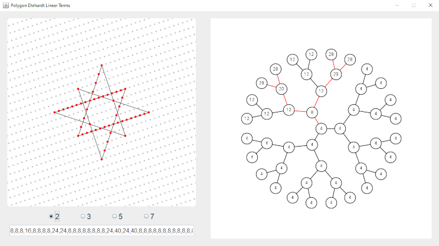

LatticePolygons
===============
App for thinking about lattice polygons.

Usage
-----

The main purpose of the app is to draw polygons using click-and-drag in the left-hand canvas. Right click deletes lines. This will show a section of the Bruhat-Tits tree labelled with the linear coefficients of the Ehrhardt polynomial of the given polynomial, in the lattice corresponding to each leaf of the tree. The size of the section shown can be controlled using the mouse wheel while hovering over the right-hand panel.

Scrolling the mouse wheel over the canvas will zoom in or out.

Pressing shift (anywhere) will replace the coefficients on the Bruhat-Tits tree by the projective points corresponding to the lattice belonging to each leaf. Additionally, clicking on any node of the tree will visualize the corresponding lattice in the canvas.

As a little bonus, the left-hand text field shows twice the coefficients in the tree, sorted in breadth-first order.

Build
-----
A complete build is available in the Releases section.

You can also build the project yourself with

	javac -d bin -sourcepath src src/org/ribozyme/polygons/PolygonWindow.java
	jar -cfe LatticePolygons.jar org.ribozyme.polygons.PolygonWindow -C bin .

No additional libraries are required.

Requires Java version 17 or higher to build and use.